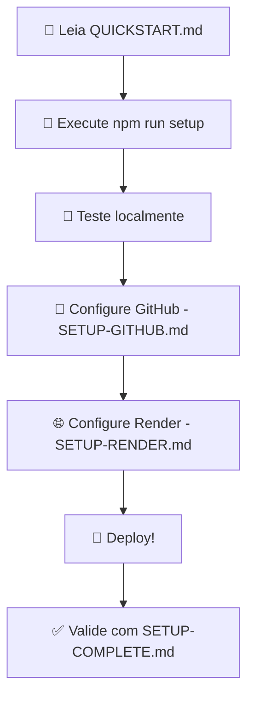

# 📚 Documentação - Avila Dashboard v2.1.0

Bem-vindo à documentação completa do Avila Dashboard Backend!

## 🗂️ Índice de Documentos

### 🚀 Início Rápido

| Documento | Tempo | Descrição |
|-----------|-------|-----------|
| **[QUICKSTART.md](./QUICKSTART.md)** | 15 min | **COMECE AQUI!** Setup completo em 3 passos |
| [SETUP-COMPLETE.md](./SETUP-COMPLETE.md) | 5 min | Resumo e checklist de validação |

### 🔧 Configuração Detalhada

| Documento | Tempo | Descrição |
|-----------|-------|-----------|
| **[SETUP-GITHUB.md](./SETUP-GITHUB.md)** | 30 min | Configuração completa do GitHub |
| **[SETUP-RENDER.md](./SETUP-RENDER.md)** | 30 min | Deploy e configuração do Render |
| [DEPLOY-INSTRUCTIONS.md](./DEPLOY-INSTRUCTIONS.md) | 20 min | Instruções gerais de deploy |

### 📖 Recursos Avançados

| Documento | Descrição |
|-----------|-----------|
| [IMPROVEMENTS.md](./IMPROVEMENTS.md) | Melhorias implementadas |
| [WHITE_LABEL_SYSTEM.md](./WHITE_LABEL_SYSTEM.md) | Sistema white label |

---

## 🎯 Fluxo Recomendado

Para configurar tudo do zero, siga esta ordem:



### Passo a Passo:

1. **Leia primeiro:** [QUICKSTART.md](./QUICKSTART.md)
   - Visão geral do processo
   - Requisitos
   - Checklist

2. **Configure:** Execute `npm run setup` ou `npm run setup:win`
   - Cria arquivo `.env`
   - Configura tokens
   - Gera secrets
   - Instala dependências

3. **GitHub:** Leia [SETUP-GITHUB.md](./SETUP-GITHUB.md)
   - Criar token
   - Configurar repositório
   - Conectar com Render

4. **Render:** Leia [SETUP-RENDER.md](./SETUP-RENDER.md)
   - Criar web service
   - Configurar variáveis
   - Deploy automático

5. **Valide:** Use [SETUP-COMPLETE.md](./SETUP-COMPLETE.md)
   - Checklist final
   - Testes
   - Troubleshooting

---

## 📋 Por Tipo de Tarefa

### Quero fazer setup inicial
→ [QUICKSTART.md](./QUICKSTART.md)

### Quero configurar GitHub
→ [SETUP-GITHUB.md](./SETUP-GITHUB.md)

### Quero fazer deploy no Render
→ [SETUP-RENDER.md](./SETUP-RENDER.md)

### Quero validar minha configuração
→ [SETUP-COMPLETE.md](./SETUP-COMPLETE.md)

### Tenho problemas
→ [QUICKSTART.md](./QUICKSTART.md#troubleshooting) (seção Troubleshooting)

### Quero entender o deploy geral
→ [DEPLOY-INSTRUCTIONS.md](./DEPLOY-INSTRUCTIONS.md)

---

## 🔍 Busca Rápida

### Procuro informações sobre...

**Tokens e Credenciais:**
- GitHub Token → [SETUP-GITHUB.md#gerar-token](./SETUP-GITHUB.md)
- MongoDB URI → [QUICKSTART.md#mongodb-atlas](./QUICKSTART.md)
- Secrets → [SETUP-COMPLETE.md#segurança](./SETUP-COMPLETE.md)

**Configuração:**
- Arquivo .env → Todos os guias
- Variáveis de ambiente → [SETUP-RENDER.md#variáveis](./SETUP-RENDER.md)
- Health check → [SETUP-RENDER.md#health-check](./SETUP-RENDER.md)

**Deploy:**
- Deploy automático → [SETUP-RENDER.md#deploy-automático](./SETUP-RENDER.md)
- CI/CD → [SETUP-GITHUB.md#github-actions](./SETUP-GITHUB.md)
- Domínio customizado → [SETUP-RENDER.md#domínio](./SETUP-RENDER.md)

**Problemas:**
- Erros comuns → [QUICKSTART.md#troubleshooting](./QUICKSTART.md)
- MongoDB não conecta → [QUICKSTART.md#mongodb-connection-failed](./QUICKSTART.md)
- GitHub API 401 → [SETUP-GITHUB.md#token-não-funciona](./SETUP-GITHUB.md)
- Render deploy failed → [SETUP-RENDER.md#build-falhou](./SETUP-RENDER.md)

---

## 📊 Níveis de Experiência

### 🟢 Iniciante
Nunca configurou um ambiente Node.js ou nunca fez deploy

**Recomendação:**
1. [QUICKSTART.md](./QUICKSTART.md) - Leia completo
2. Execute `npm run setup:win` (Windows) ou `npm run setup` (outros)
3. Siga o guia passo a passo
4. Use [SETUP-COMPLETE.md](./SETUP-COMPLETE.md) para validar

**Tempo estimado:** 1-2 horas

### 🟡 Intermediário
Já configurou projetos Node.js antes, mas não conhece Render

**Recomendação:**
1. [QUICKSTART.md](./QUICKSTART.md) - Visão rápida
2. [SETUP-RENDER.md](./SETUP-RENDER.md) - Foco no Render
3. Configure e faça deploy

**Tempo estimado:** 30-45 minutos

### 🔴 Avançado
Já trabalha com Node.js, GitHub e plataformas de deploy

**Recomendação:**
1. Execute `npm run setup`
2. Revise [SETUP-COMPLETE.md](./SETUP-COMPLETE.md)
3. Configure variáveis no Render
4. Deploy!

**Tempo estimado:** 15-20 minutos

---

## 🛠️ Scripts Disponíveis

### Setup
```bash
npm run setup        # Setup Node.js (cross-platform)
npm run setup:win    # Setup PowerShell (Windows)
```

### Desenvolvimento
```bash
npm run dev          # Inicia com hot reload
npm run start:dev    # Inicia sem hot reload
```

### Produção
```bash
npm start            # Modo produção
npm run prod         # Alias
```

### Build
```bash
npm run build        # Compila TypeScript
npm run build:prod   # Build completo + minify
```

---

## 🧪 Endpoints de Teste

Após configurar, teste com:

```bash
# Health check simples
curl http://localhost:3000/health

# Health check detalhado
curl http://localhost:3000/api/health

# Status da configuração
curl http://localhost:3000/api/config/status

# GitHub repos
curl http://localhost:3000/api/github/repos
```

---

## 📁 Estrutura da Documentação

```
docs/
├── README.md                    # 📚 Este arquivo (índice)
├── QUICKSTART.md               # 🚀 Início rápido (15 min)
├── SETUP-GITHUB.md             # 🔧 GitHub completo
├── SETUP-RENDER.md             # 🌐 Render e deploy
├── SETUP-COMPLETE.md           # ✅ Resumo e validação
├── DEPLOY-INSTRUCTIONS.md      # 📦 Deploy geral
├── IMPROVEMENTS.md             # 📈 Melhorias
└── WHITE_LABEL_SYSTEM.md       # 🏷️ White label
```

---

## 🎯 Objetivos de Cada Documento

### QUICKSTART.md
**Objetivo:** Configurar tudo em 15 minutos
- Setup rápido em 3 passos
- Obter credenciais rapidamente
- Validação básica
- Troubleshooting rápido

### SETUP-GITHUB.md
**Objetivo:** Dominar a integração com GitHub
- Gerar token com permissões corretas
- Configurar repositório
- Webhooks e secrets
- GitHub Actions (CI/CD)
- Troubleshooting GitHub

### SETUP-RENDER.md
**Objetivo:** Deploy profissional no Render
- Criar e configurar web service
- Variáveis de ambiente
- Deploy automático via Git
- Domínio customizado
- Monitoramento e logs
- Render API
- Otimizações de performance

### SETUP-COMPLETE.md
**Objetivo:** Validar e documentar tudo
- Arquivos criados
- Checklist completo
- Testes de validação
- Status de cada serviço
- Próximos passos
- Recursos úteis

---

## 🔗 Links Úteis

### Plataformas
- GitHub: https://github.com
- Render: https://render.com
- MongoDB Atlas: https://cloud.mongodb.com

### Documentação Oficial
- GitHub API: https://docs.github.com/en/rest
- Render Docs: https://render.com/docs
- MongoDB Docs: https://docs.mongodb.com
- Node.js: https://nodejs.org/docs

### Ferramentas
- GitHub CLI: https://cli.github.com
- Render CLI: https://render.com/docs/cli
- MongoDB Compass: https://www.mongodb.com/products/compass
- Postman: https://www.postman.com

---

## ❓ FAQ

### Qual documento devo ler primeiro?
[QUICKSTART.md](./QUICKSTART.md) sempre!

### Quanto tempo leva o setup completo?
- Iniciante: 1-2 horas
- Intermediário: 30-45 minutos
- Avançado: 15-20 minutos

### Preciso ler todos os documentos?
Não! Use o fluxo recomendado ou busque por tarefa específica.

### Onde encontro soluções para erros?
Cada guia tem seção de Troubleshooting. Comece pelo [QUICKSTART.md](./QUICKSTART.md).

### Como atualizo a documentação?
Abra um PR no GitHub com suas sugestões!

---

## 🤝 Contribuindo

Encontrou algo que pode melhorar?

1. Abra uma issue descrevendo
2. Ou faça um PR com a correção
3. Ajude outros desenvolvedores!

---

## 📝 Changelog

### v2.1.0 (2024)
- ✅ Documentação completa criada
- ✅ QUICKSTART.md adicionado
- ✅ SETUP-GITHUB.md completo
- ✅ SETUP-RENDER.md completo
- ✅ SETUP-COMPLETE.md com validações
- ✅ Scripts de setup automatizado
- ✅ Health check middleware
- ✅ README.md (este arquivo)

---

## 🎉 Pronto para Começar?

Acesse: **[QUICKSTART.md](./QUICKSTART.md)** e comece agora! 🚀

---

**Autor:** Nicolas Ávila  
**Versão:** 2.1.0  
**Data:** 2024  
**Licença:** MIT
