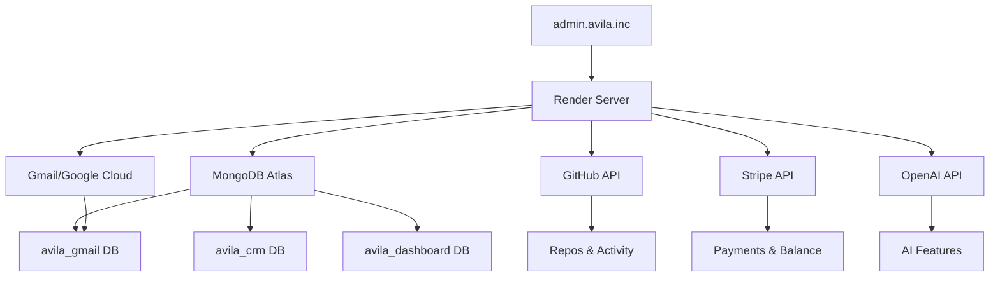

# 🔍 ANÁLISE COMPLETA - Todos os Serviços do admin.avila.inc

## 📊 RESUMO EXECUTIVO

**Projeto:** admin.avila.inc  
**Tipo:** Dashboard Backend Unificado  
**Versão:** 2.1.0  
**Total de Serviços Integrados:** 23+  

---

## 🗂️ CATEGORIZAÇÃO DE SERVIÇOS

### 1️⃣ **INFRAESTRUTURA & HOSTING** (6 serviços)

| Serviço | Status | Propósito | Variáveis |
|---------|--------|-----------|-----------|
| **MongoDB Atlas** | 🟢 Ativo | Database principal | `MONGO_ATLAS_URI` |
| **Render** | 🟢 Ativo | Hosting/Deploy | `RENDER=true`, `NODE_ENV` |
| **Railway** | 🟡 Opcional | Deploy alternativo | `RAILWAY_TOKEN` |
| **Ngrok** | 🟡 Dev | Túnel local | `NGROK` |
| **Porkbun DNS** | 🟢 Ativo | Gerenciamento DNS | `PORKBUN_API_KEY`, `PORKBUN_SECRET_KEY` |
| **Cloudflare** | 🟡 Opcional | CDN/DNS | `CLOUDFLARE_API_KEY` |

**Domínio Principal:** `admin.avila.inc`

---

### 2️⃣ **DESENVOLVIMENTO & CI/CD** (4 serviços)

| Serviço | Status | Propósito | Variáveis |
|---------|--------|-----------|-----------|
| **GitHub** | 🟢 Ativo | Versionamento + API | `GITHUB_USERNAME`, `GITHUB_TOKEN` |
| **Azure DevOps** | 🟡 Opcional | CI/CD alternativo | `AZURE_DEVOPS_API` |
| **Sentry** | 🟡 Opcional | Error tracking | `SENTRY_TOKEN_API` |
| **Cargo Registry** | 🟡 Opcional | Pacotes Rust | `CARGO_REGISTRY_TOKEN` |

**Rotas GitHub:**
- `GET /api/github/repos` - Lista repositórios
- `GET /api/github/activity` - Atividades recentes

---

### 3️⃣ **INTELIGÊNCIA ARTIFICIAL** (4 serviços)

| Serviço | Status | Propósito | Variáveis |
|---------|--------|-----------|-----------|
| **OpenAI** | 🟢 Ativo | GPT-4, embeddings | `OPENAI_API_KEY` |
| **LangSmith** | 🟡 Opcional | Tracing LLM | `LANGSMITH_API_KEY` |
| **Hugging Face** | 🟡 Opcional | Modelos ML | `HF_TOKEN` |
| **DeepSeek** | 🟡 Opcional | LLM alternativo | `DEEPSEEK_API_KEY` |
| **Ollama** | 🟡 Opcional | LLM local | `OLLAMA_API_KEY` |

---

### 4️⃣ **PAGAMENTOS** (3 serviços)

| Serviço | Status | Propósito | Variáveis |
|---------|--------|-----------|-----------|
| **Stripe** | 🟢 Ativo | Processamento de pagamentos | `STRIPE_API`, `STRIPE_API_TOKEN` |
| **PayPal** | 🟡 Opcional | Pagamentos alternativos | `PAYPAL_ID`, `PAYPAL_TOKEN_API` |

**Rotas Stripe:**
- `GET /api/payments/stripe/balance` - Saldo e transações

**Funcionalidades:**
- Balance retrieval
- Charges listing
- Customers management

---

### 5️⃣ **COMUNICAÇÃO & EMAIL** (3 serviços)

| Serviço | Status | Propósito | Variáveis |
|---------|--------|-----------|-----------|
| **Gmail (Múltiplas Contas)** | 🟢 Ativo | Gerenciamento de emails | `GMAIL_USER_1/2/3`, `GMAIL_PASS_1/2/3` |
| **Google Cloud (Gmail API)** | 🟢 Ativo | API integrada | `GCLOUD_API_TOKEN`, `GCLOUD_CLIENT`, `GCLOUD_SECRET_KEY` |
| **SMTP** | 🟢 Ativo | Envio de emails | `EMAIL_HOST`, `EMAIL_PORT`, `EMAIL_USER`, `EMAIL_PASSWORD` |

**Serviço Gmail:**
- Database: `avila_gmail`
- Collections: `emails`
- Stats por conta
- Busca por account
- Limite configurável

---

### 6️⃣ **CRM & CONTATOS** (2 serviços)

| Serviço | Status | Propósito | Variáveis |
|---------|--------|-----------|-----------|
| **CRM Interno** | 🟢 Ativo | Gestão de leads/clientes | MongoDB `avila_crm` |
| **LinkedIn** | 🟡 Opcional | Networking profissional | `LINKEDIN_CLIENT_ID`, `LINKEDIN_CLIENT_SECRET`, `LINKEDIN_ACCESS_TOKEN` |

**Database CRM:**
- Database: `avila_crm`
- Collections: `leads`, `contacts`
- Funcionalidades:
  - ✅ Create lead
  - ✅ Validação de duplicatas
  - ✅ Status tracking
  - ✅ Observações

**Campos Lead:**
- nome, email, telefone (obrigatórios)
- empresa, fonte, status, observações

---

### 7️⃣ **SEGURANÇA & AUTENTICAÇÃO** (2 serviços)

| Componente | Status | Propósito | Variáveis |
|------------|--------|-----------|-----------|
| **JWT** | 🟢 Ativo | Autenticação token | `JWT_SECRET` |
| **Session** | 🟢 Ativo | Gerenciamento de sessão | `SESSION_SECRET` |

**Middleware:**
- `authenticate` - Proteção de rotas
- `asyncHandler` - Error handling

---

## 📂 ESTRUTURA DE ARQUIVOS

### **Rotas Disponíveis** (src/routes/)

```
src/routes/
├── auth.routes.js              # Autenticação
├── contacts.routes.js          # Gestão de contatos
├── github.routes.js            # GitHub API
├── github.routes.complete.js   # GitHub completo
├── mongodb.routes.js           # MongoDB admin
└── payments.routes.js          # Pagamentos
```

### **Serviços** (src/services/)

```
src/services/
├── calendar.service.ts         # Calendário
├── campanhas.service.ts        # Campanhas marketing
├── crm.service.ts             # CRM principal
├── ereader.service.ts         # E-reader (biblioteca)
├── gmail.service.ts           # Gmail integration
├── mongodb.service.ts         # MongoDB utilities
└── universal.service.ts       # Serviços universais
```

### **Configuração** (src/config/)

```
src/config/
├── config.js                   # Config centralizada
└── production.config.js        # Config produção
```

---

## 🔌 ENDPOINTS PRINCIPAIS

### **Health Checks**
```
GET /health                     # Status simples
GET /api/health                 # Status detalhado
GET /ready                      # Readiness probe
GET /alive                      # Liveness probe
GET /ping                       # Ping simples
```

### **GitHub**
```
GET /api/github/repos           # Lista repos
GET /api/github/activity        # Atividades
```

### **Pagamentos**
```
GET /api/payments/stripe/balance  # Stripe balance
```

### **Configuração**
```
GET /api/config/status          # Status de todos serviços
```

---

## 🎯 SERVIÇOS POR STATUS

### 🟢 **ATIVOS (Core)** - 8 serviços
1. MongoDB Atlas
2. Render
3. GitHub
4. OpenAI
5. Stripe
6. Gmail (3 contas)
7. Google Cloud
8. CRM Interno

### 🟡 **OPCIONAIS/FUTUROS** - 15+ serviços
1. Railway
2. Azure DevOps
3. Sentry
4. PayPal
5. LinkedIn
6. Cloudflare
7. Ngrok
8. LangSmith
9. Hugging Face
10. DeepSeek
11. Ollama
12. Cargo Registry

---

## 📊 DATABASES UTILIZADAS

### **MongoDB Atlas** - 3+ databases

| Database | Collections | Propósito |
|----------|-------------|-----------|
| `avila_gmail` | `emails` | Emails sincronizados |
| `avila_crm` | `leads`, `contacts` | CRM e contatos |
| `avila_dashboard` | (principal) | Dados gerais |

---

## 🔐 VARIÁVEIS DE AMBIENTE

### **Essenciais (Obrigatórias)**
```env
# Database
MONGO_ATLAS_URI=mongodb+srv://...

# GitHub
GITHUB_USERNAME=seu_usuario
GITHUB_TOKEN=ghp_...

# Security
JWT_SECRET=generated_secret
SESSION_SECRET=generated_secret

# Domain
CORS_ORIGIN=https://admin.avila.inc
```

### **Serviços Ativos**
```env
# AI
OPENAI_API_KEY=sk-proj-...

# Payments
STRIPE_API_TOKEN=sk_test_...
STRIPE_API=pk_test_...

# Email
GMAIL_USER_1=email1@gmail.com
GMAIL_PASS_1=senha_app_1
GMAIL_USER_2=email2@gmail.com
GMAIL_PASS_2=senha_app_2
GMAIL_USER_3=email3@gmail.com
GMAIL_PASS_3=senha_app_3

# Google Cloud
GCLOUD_API_TOKEN=AIzaSy...
GCLOUD_CLIENT=...apps.googleusercontent.com
GCLOUD_SECRET_KEY=GOCSPX-...

# DNS
PORKBUN_API_KEY=sua_chave
PORKBUN_SECRET_KEY=sua_secret
```

### **Opcionais**
```env
# Deploy
RAILWAY_TOKEN=token
RENDER=true

# Monitoring
SENTRY_TOKEN_API=sntrys_...

# DevOps
AZURE_DEVOPS_API=token

# LinkedIn
LINKEDIN_CLIENT_ID=id
LINKEDIN_CLIENT_SECRET=secret
LINKEDIN_ACCESS_TOKEN=token

# PayPal
PAYPAL_ID=id
PAYPAL_TOKEN_API=token

# AI Extra
LANGSMITH_API_KEY=lsv2_sk_...
HF_TOKEN=hf_...
DEEPSEEK_API_KEY=sk-...
OLLAMA_API_KEY=token

# CDN
CLOUDFLARE_API_KEY=key
```

---

## 🚀 FLUXO DE DADOS



---

## 📈 MÉTRICAS DO PROJETO

### **Complexidade**
- **Serviços Integrados:** 23+
- **Databases:** 3+
- **Rotas:** 10+
- **Serviços (classes):** 7+
- **Middlewares:** 3+

### **Funcionalidades**
- ✅ Dashboard unificado
- ✅ CRM completo
- ✅ Gestão de emails (3 contas)
- ✅ Integração GitHub
- ✅ Processamento de pagamentos
- ✅ AI features (OpenAI)
- ✅ Health monitoring
- ✅ Autenticação JWT
- ✅ E-reader/Biblioteca
- ✅ Calendário
- ✅ Campanhas

---

## 🎯 CONFIGURAÇÃO RECOMENDADA

### **Para Produção (admin.avila.inc)**

#### **Render.yaml Otimizado**
```yaml
services:
  - type: web
    name: avila-manager
    runtime: node
    env: node
    region: oregon
    plan: starter  # Upgrade recomendado
    buildCommand: npm install
    startCommand: node server.js
    
    # Custom domain
    domains:
      - admin.avila.inc
    
    # Health check
    healthCheckPath: /health
    
    envVars:
      - key: NODE_VERSION
        value: 22.22.0
      - key: NODE_ENV
        value: production
      - key: RENDER
        value: true
      - key: CORS_ORIGIN
        value: https://admin.avila.inc
```

#### **DNS Configuration (Porkbun)**
```
Type: CNAME
Name: admin
Value: avila-manager.onrender.com
TTL: 300
```

---

## 🔒 SEGURANÇA

### **Implementado**
- ✅ JWT Authentication
- ✅ Session Management
- ✅ CORS configurável
- ✅ Environment variables
- ✅ Helmet.js (headers)
- ✅ Rate limiting

### **Recomendações**
- 🔸 Ativar Sentry (error tracking)
- 🔸 2FA para admin
- 🔸 IP whitelist no MongoDB
- 🔸 Rotate tokens periodicamente
- 🔸 Configurar SSL/TLS forte
- 🔸 Backup automático MongoDB

---

## 📊 STATUS DE INTEGRAÇÃO

### **Totalmente Integrado** ✅
1. MongoDB Atlas - 100%
2. GitHub API - 100%
3. Stripe - 100%
4. Gmail Service - 100%
5. CRM Service - 100%
6. Health Checks - 100%

### **Parcialmente Integrado** 🟡
1. OpenAI - API config OK, features pendentes
2. Google Cloud - Auth OK, APIs parciais
3. LinkedIn - Config pronto, uso opcional

### **Configurado (Não usado)** ⚪
1. Railway
2. Azure DevOps
3. PayPal
4. Sentry
5. LangSmith
6. HuggingFace
7. DeepSeek
8. Ollama

---

## 🎯 PRÓXIMOS PASSOS RECOMENDADOS

### **Curto Prazo (Esta Semana)**
1. ✅ Deploy no Render com domínio `admin.avila.inc`
2. ✅ Configurar DNS no Porkbun
3. ✅ Testar todos endpoints em produção
4. ⚪ Ativar SSL (automático no Render)
5. ⚪ Configurar backup MongoDB

### **Médio Prazo (Este Mês)**
1. ⚪ Ativar Sentry para monitoring
2. ⚪ Implementar features OpenAI
3. ⚪ Expandir CRM (dashboard visual)
4. ⚪ Adicionar analytics
5. ⚪ Documentar APIs (Swagger)

### **Longo Prazo (Trimestre)**
1. ⚪ LinkedIn automation
2. ⚪ PayPal integration
3. ⚪ Email campaigns
4. ⚪ AI-powered insights
5. ⚪ Mobile app

---

## 💰 CUSTOS ESTIMADOS

### **Atual (Plano Free)**
- Render Free: $0/mês
- MongoDB Atlas Free: $0/mês
- GitHub Free: $0/mês
- **Total:** $0/mês

### **Recomendado (Produção)**
- Render Starter: $7/mês
- MongoDB Atlas Shared: $9/mês
- Domínio (Porkbun): ~$12/ano
- **Total:** ~$17/mês

### **Opcional (Escala)**
- OpenAI API: Pay-as-you-go
- Stripe: 2.9% + $0.30/transação
- Sentry: $26/mês (Team)
- CDN Cloudflare: $0 (Free)

---

## 🔗 LINKS IMPORTANTES

### **Produção**
- Dashboard: https://admin.avila.inc
- Health: https://admin.avila.inc/health
- API Docs: https://admin.avila.inc/api/docs

### **Desenvolvimento**
- Local: http://localhost:3000
- Health: http://localhost:3000/health

### **Admin/Config**
- Render: https://dashboard.render.com
- MongoDB: https://cloud.mongodb.com
- GitHub: https://github.com
- Porkbun: https://porkbun.com

---

## 📞 SUPORTE

### **Serviços Críticos**
- **MongoDB:** https://support.mongodb.com
- **Render:** https://render.com/docs
- **GitHub:** https://support.github.com
- **Stripe:** https://support.stripe.com

### **Documentação**
- `docs/QUICKSTART.md` - Setup rápido
- `docs/SETUP-RENDER.md` - Render config
- `docs/SETUP-GITHUB.md` - GitHub config
- `docs/COMMANDS.md` - Comandos úteis

---

## ✅ CHECKLIST DE PRODUÇÃO

### **Pré-Deploy**
- [ ] Todas variáveis de ambiente configuradas
- [ ] Secrets gerados (JWT, Session)
- [ ] MongoDB whitelist configurado
- [ ] GitHub token válido
- [ ] Stripe em modo test primeiro

### **Deploy**
- [ ] Render web service criado
- [ ] Domínio `admin.avila.inc` configurado
- [ ] DNS apontando corretamente
- [ ] SSL ativo
- [ ] Health check OK

### **Pós-Deploy**
- [ ] Testar todos endpoints
- [ ] Verificar logs
- [ ] Configurar monitoring
- [ ] Documentar APIs
- [ ] Setup backup

---

**Análise criada em:** 2024  
**Versão do Projeto:** 2.1.0  
**Domínio:** admin.avila.inc  
**Status:** Production Ready ✅
